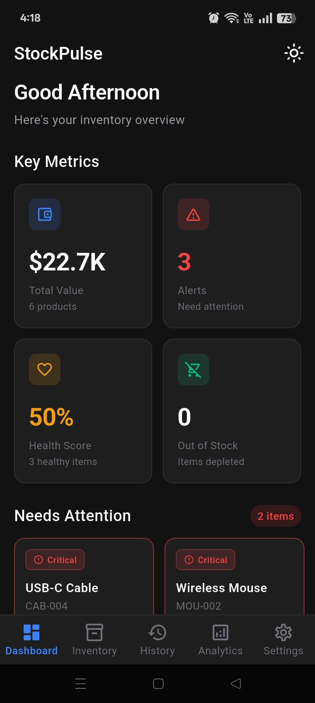
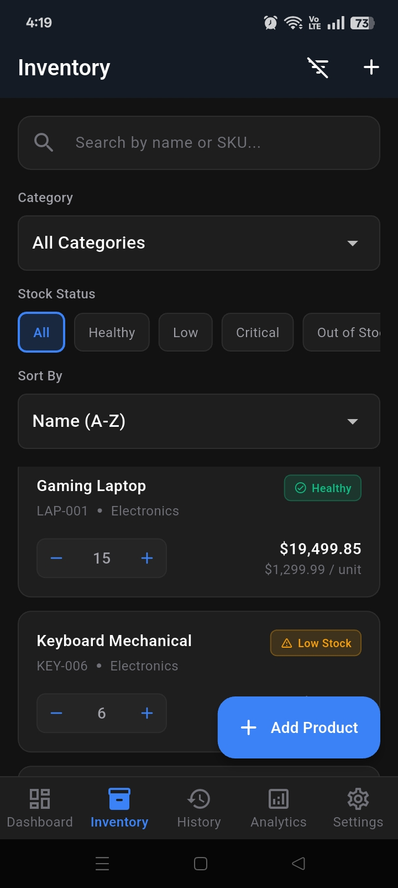
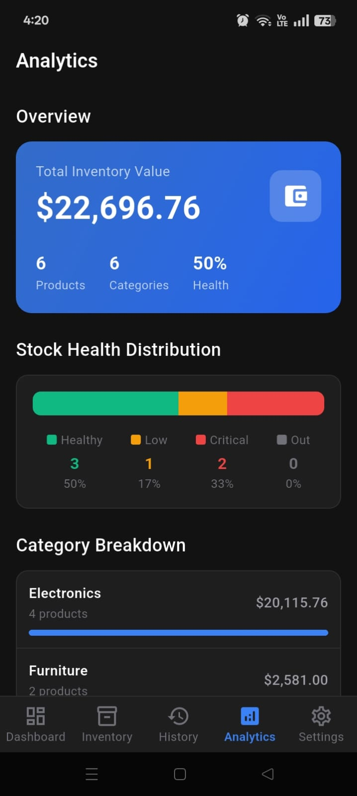
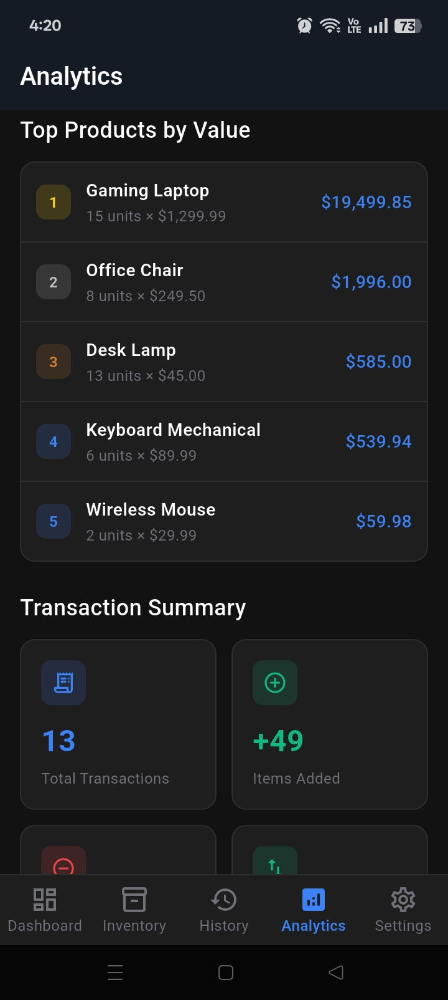
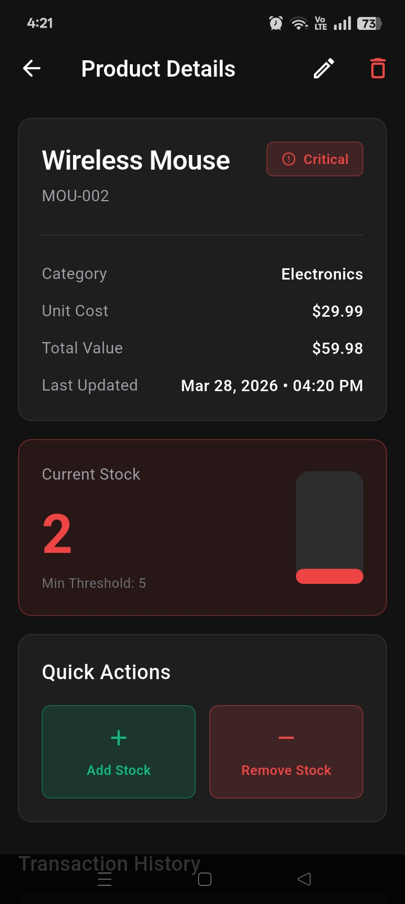

```markdown
# StockPulse - Inventory Management System

A modern, scalable **B2B inventory management system** built with Flutter, designed to deliver real-time insights, efficient stock handling, and a clean, professional user experience.

---

## 📊 Overview

**StockPulse** is a feature-rich inventory management application that enables businesses to track stock levels, monitor performance, and gain actionable insights through an intuitive dashboard.

Built using **Flutter and Provider**, the application follows a **clean architecture pattern**, ensuring scalability, maintainability, and high performance.

---

## 🚀 Features

| Feature | Description |
|--------|------------|
| 📈 Real-time Dashboard | Displays key metrics such as Total Inventory Value, Alerts, and Health Score |
| 📦 Inventory Management | Full CRUD operations, search, filters, and inline stock adjustments |
| 🧾 Audit Trail | Complete transaction history with advanced filtering |
| 📊 Analytics | Health distribution, category breakdown, and top-performing products |
| ⚙️ Settings | Theme toggle, category management, and data controls |
| 🌗 Dark/Light Mode | Seamless theme switching |

---

## 🛠️ Tech Stack

<p align="left">
  
  
  
  
</p>

---

## 📁 Project Structure

```

stockpulse/
│
├── lib/
│   ├── core/
│   │   ├── constants/
│   │   │   ├── app_colors.dart
│   │   │   └── app_text_styles.dart
│   │   ├── theme/
│   │   │   ├── app_theme.dart
│   │   │   └── theme_provider.dart
│   │   └── utils/
│   │       └── helpers.dart
│   │
│   ├── models/
│   │   ├── category_model.dart
│   │   ├── product_model.dart
│   │   └── transaction_model.dart
│   │
│   ├── providers/
│   │   ├── category_provider.dart
│   │   ├── inventory_provider.dart
│   │   ├── transaction_provider.dart
│   │   └── theme_provider.dart
│   │
│   ├── screens/
│   │   ├── dashboard/
│   │   │   └── dashboard_screen.dart
│   │   ├── inventory/
│   │   │   ├── inventory_screen.dart
│   │   │   ├── add_product_screen.dart
│   │   │   └── product_detail_screen.dart
│   │   ├── audit_trail/
│   │   │   └── audit_trail_screen.dart
│   │   ├── analytics/
│   │   │   └── analytics_screen.dart
│   │   └── settings/
│   │       └── settings_screen.dart
│   │
│   ├── widgets/
│   │   ├── common/
│   │   │   ├── custom_app_bar.dart
│   │   │   ├── custom_text_field.dart
│   │   │   ├── primary_button.dart
│   │   │   ├── status_badge.dart
│   │   │   └── empty_state.dart
│   │   ├── dashboard/
│   │   │   ├── metric_card.dart
│   │   │   └── quick_action_card.dart
│   │   └── inventory/
│   │       └── product_card.dart
│   │
│   └── main.dart
│
├── android/
├── ios/
├── web/
│
├── screenshots/
│   ├── dashboard.jpeg
│   ├── inventory.jpeg
│   ├── analytics1.jpeg
│   ├── analytics2.jpeg
│   └── product_detail.jpeg
│
├── pubspec.yaml
├── analysis_options.yaml
└── README.md

```

---

## 🏗️ Architecture Highlights

| Layer | Purpose | Components |
|------|--------|-----------|
| Core | App-wide configuration | Theme, colors, utilities |
| Models | Data structures | Immutable models |
| Providers | State & business logic | 4 providers |
| Screens | Feature modules | Dashboard, Inventory, Analytics, etc. |
| Widgets | Reusable UI | Shared components |

---

## 📊 Provider Architecture

```

MultiProvider
├── ThemeProvider          → App theme state
├── CategoryProvider       → Category management
├── InventoryProvider      → Product CRUD & logic
└── TransactionProvider    → Audit trail & filtering

Total: 4 providers

````

---

## 🎨 Design System

- Typography: Poppins (headings), Inter (body), JetBrains Mono (data)
- Themes: Dark (default), Light
- Status Colors:
  - Healthy → Green  
  - Low → Amber  
  - Critical → Red  
  - Out of Stock → Gray  
- Reusable Components: 11 custom widgets

---

## 📸 Screenshots

### Dashboard


### Inventory


### Analytics
<p align="center">
  
  
</p>

### Product Detail


---

## ⚙️ Installation

```bash
git clone https://github.com/SyedAsharRaza/StockPulse.git
cd StockPulse
flutter pub get
flutter run
````

---

## 🔮 Future Enhancements

* Cloud integration (Firebase / APIs)
* Role-based authentication
* Barcode/QR scanning
* Export reports (PDF/Excel)
* Notifications system
* Multi-language support

---

## 👤 Author

**Syed Ashar Raza**

* GitHub: [https://github.com/SyedAsharRaza](https://github.com/SyedAsharRaza)
* Email: [asharrazanaqvi@gmail.com](mailto:asharrazanaqvi@gmail.com)
* LinkedIn: [https://www.linkedin.com/in/ashar-raza-129484325/](https://www.linkedin.com/in/ashar-raza-129484325/)

---

## ⭐ Support

If you found this project useful, give it a star ⭐ on GitHub.

```
```
